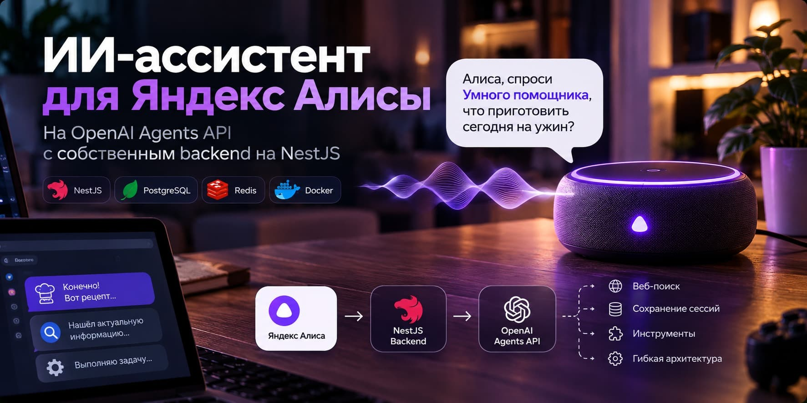
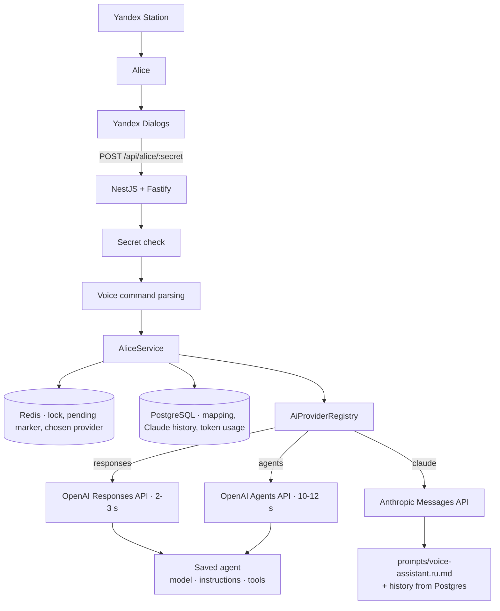

# makealicebetter

*English · [Русский](README.md)*

Backend for a private Yandex Alice skill that answers any question through OpenAI or Claude — your choice, switchable by voice.

You ask a Yandex Station speaker "Alice, ask the robot uncle what I can cook with chicken and cabbage" and the answer comes back right away, together with the skill launch. Or you launch the skill on its own and keep talking: "explain quantum entanglement in simple words", "tell me more". ("Robot uncle" is the activation phrase — you choose your own.) The skill keeps the conversation context, fits Yandex's hard response limit, and survives a server restart.

```
Yandex Station → Alice → Yandex Dialogs → this backend → OpenAI / Claude
```

## Contents

- [How it works](#how-it-works) · [Code layout](#code-layout)
- [Quick start](#quick-start)
- [OpenAI setup](#openai-setup)
- [Claude setup](#claude-setup)
- [Yandex Dialogs setup](#yandex-dialogs-setup)
- [Response speed](#response-speed)
- [Deferred answers](#deferred-answers)
- [Voice commands](#voice-commands)
- [Environment variables](#environment-variables)
- [Database](#database)
- [Operations](#operations) · [Partial outages](#partial-outages)
- [Deployment](#deployment)
- [Security](#security)
- [Troubleshooting](#troubleshooting)
- [Tests](#tests)
- [Known limitations](#known-limitations)
- [License](#license)

## How it works

**The skill answers through OpenAI or through Claude, switchable by voice.** The provider is chosen on the fly — "переключись на клода", "переключись на чатгпт" — and every difference between them hides inside the provider: the orchestration never learns who it is talking to.

That difference is not small. OpenAI remembers the conversation on its side, so we store only the mapping "Alice user → conversation id". Anthropic's Messages API remembers nothing: the history has to live in Postgres and be resent in full with every question.



**A slow answer is never lost.** Dialogs enforce a hard 4.5-second limit. When we miss it, we say "I need a bit more time" — but we do not drop the connection: the answer keeps streaming in the background, and the user picks it up with a follow-up like "so?".

### Code layout

| Module | Responsibility |
|---|---|
| `src/alice` | Dialogs protocol: controller, secret guard, DTOs, command parsing, response building, orchestration |
| `src/ai` | The only boundary with the models: `AiConversationProvider` interface, the provider registry, `OpenAIResponsesService`, `OpenAIAgentsService`, `ClaudeMessagesService`, fake provider for local runs |
| `src/conversations` | Postgres: users, conversations, turn records, Claude message history |
| `src/pending` | Redis: the "one answer per user" lock and the unfinished-answer marker |
| `src/speech` | Making an answer speakable: markdown, lists, links, length |
| `src/usage` | Token accounting and admin aggregates |
| `src/tools` | Registry of local functions the agent may call (empty for now) |
| `src/memory` | Placeholder for long-term memory across conversations |
| `src/admin`, `src/health` | `/api/admin/usage`, `/health`, `/ready` |

## Quick start

You need Node.js 24 LTS (22.13 minimum), PostgreSQL 16+, Redis 7+ and an OpenAI account. Or just Docker — compose brings everything up.

```bash
cp .env.example .env    # fill in OPENAI_API_KEY, OPENAI_AGENT_ID, ALICE_WEBHOOK_SECRET
docker compose up -d --build
docker compose exec app npm run migration:run:built
curl localhost:3000/health
```

Without containers:

```bash
npm install
npm run migration:run
npm run dev
```

No OpenAI key yet? Set `OPENAI_FAKE=true` and a fake provider takes over. It behaves like the real one: remembers the conversation, can answer slowly (`FAKE_DELAY_MS`), fail (`FAKE_FAIL=true`), cancel (`FAKE_CANCEL=true`) and request a function call (`FAKE_REQUIRES_ACTION=true`).

## OpenAI setup

The model, instructions, reasoning effort and tools live **in a saved agent**, not in the code: the backend only knows its id and forwards those settings with every request.

1. Open [OpenAI Platform](https://platform.openai.com/) → Agents → Create.
2. Write the instructions. A version that works well for voice:

   ```text
   You are a home voice AI assistant. Your answer will be read aloud by a speaker.

   Answer naturally and briefly, with no preamble.
   Do not use markdown, tables or headings.
   Never give links or website addresses — they cannot be pronounced;
   if you need to credit a source, name it in words.
   Compress long lists down to the essentials.
   Answer in the user's language.

   Use web search only when the answer depends on fresh data:
   news, weather, rates, schedules. Facts, explanations, advice and
   recommendations you answer yourself — search costs about three seconds.
   ```

3. Agent settings:

   | Setting | Value | Why |
   |---|---|---|
   | Environment | `none` | The assistant needs no sandbox, and skipping it is faster |
   | Text format | `text` | Plain text goes to speech |
   | Verbosity | `low` | A long answer will not fit Alice's 1024-character limit |
   | Reasoning effort | `low` | Anything higher is noticeably slower: 2.0 s vs 4.3 s on the same question |
   | Tools | optional | Web search and MCP run on the OpenAI side |

4. Copy the agent id (`agent_…`) into `OPENAI_AGENT_ID`.
5. Create a project API key. It needs `api.responses.write`, plus `api.agents.read` and `api.agents.write` for `AI_PROVIDER=agents`.

## Claude setup

There is no saved agent here: the Messages API has neither server-side instructions nor server-side memory. Everything lives on our side.

1. Create a key in the [Anthropic Console](https://console.anthropic.com/) and top up the balance — without credits the key is still valid, but every generation returns a 400. Put it in `ANTHROPIC_API_KEY`.
2. The assistant's instructions live in [`prompts/voice-assistant.ru.md`](prompts/voice-assistant.ru.md). Edit the file (needs a redeploy) or override it with `ANTHROPIC_SYSTEM_PROMPT`.
3. Models come from variables rather than a UI: `ANTHROPIC_MODEL_FAST` (Haiku 4.5 by default) and `ANTHROPIC_MODEL_SMART` (Sonnet 5). Switching between them works by voice.
4. Web search is enabled with `ANTHROPIC_WEB_SEARCH=true` and runs on Anthropic's side — as with OpenAI, the skill notices it and says "let me look it up online".

How many past messages are resent is set by `ANTHROPIC_HISTORY_MESSAGES`. This is not a cosmetic "memory depth" setting: every message in the request is paid for and waited on again, so a long history eats Alice's budget directly.

**Where the tokens actually go.** Measured in production: one question to Claude costs about 2600 input tokens, of which roughly 2200 is the *web search tool definition*, sent with every request whether or not it searches. The conversation itself is barely visible next to it. If you do not need search, `ANTHROPIC_WEB_SEARCH=false` cuts the input almost sevenfold.

The prompt is sent with `cache_control`, but **that cache never engages today**: Anthropic requires a minimum cacheable prefix, and the voice prompt (~370 tokens) falls short of it — `cache_creation_input_tokens` is zero on every production request. The breakpoint stays as groundwork: it costs nothing and starts paying off on its own if the prompt grows.

## Yandex Dialogs setup

1. [Yandex Dialogs](https://dialogs.yandex.ru/developer) → "Create dialog" → "Alice skill".
2. Fill in the name and the activation phrase. It is not only for launching: "Alice, ask the robot uncle <question>"
   delivers the question in the very first request, and the skill answers it immediately, with no separate greeting.
   Pick a phrase Alice recognises reliably by ear.
   Put that same name in `ALICE_ACTIVATION_NAMES`: **inside an already open session Yandex does not strip it**, and
   without this setting "ask the robot uncle what to cook" reaches the model whole — which then says it has never
   heard of any robot uncle.
3. **Backend** → "Own platform", webhook URL:

   ```text
   https://your-domain/api/alice/<ALICE_WEBHOOK_SECRET>
   ```

   HTTPS with a valid certificate is required: Dialogs will not call plain HTTP.
4. Publish it as a **private skill** and add yourself as a tester.
5. Verify it on the "Testing" tab.

**How the webhook is protected.** Yandex does not sign requests, so the protection is a secret in the path. It is compared byte by byte in constant time, and a wrong secret gets `403`. You can additionally set `ALICE_SKILL_ID` to reject foreign `skill_id` values. Generate the secret with `openssl rand -hex 24`.

Checking the webhook by hand:

```bash
curl -X POST "http://localhost:3000/api/alice/$ALICE_WEBHOOK_SECRET" \
  -H 'Content-Type: application/json' \
  -d '{
    "meta": {"locale": "ru-RU", "timezone": "Europe/Moscow", "interfaces": {}},
    "session": {
      "session_id": "test", "message_id": 1, "skill_id": "test",
      "application": {"application_id": "test-device"}, "new": false
    },
    "request": {"type": "SimpleUtterance", "command": "what can I cook with chicken"},
    "version": "1.0"
  }'
```

## Response speed

Dialogs wait 4.5 seconds, and everything counts against it: Yandex's own network, our processing and the round trip to the provider. The OpenAI rows were measured on the production server (`gpt-6-luna`, reasoning `low`); the Claude rows from a laptop, so they are an upper bound:

| Measurement | Time |
|---|---|
| Round trip to OpenAI | ~0.9 s |
| **OpenAI Responses API — full answer** | **1.9–3.2 s** |
| OpenAI Agents API — turn start only | 7.2–8.5 s |
| OpenAI Agents API — full answer | 9.5–12.2 s |
| **Claude Haiku 4.5 — full answer** | **1.0–1.4 s** |
| Claude Sonnet 5 — full answer | ~3.0 s |
| Claude with web search | ~3.3 s, goes to a deferred answer |

The gap is not about the model: the Agents API spends about eight seconds just to **start** working, regardless of reasoning effort, tools or `service_tier` (`default`, `priority` and `fast` were all tested). That platform is built for long agentic jobs, not for a line in a conversation.

That is why the Responses API is the default (`AI_PROVIDER=responses`) — same agent settings, a much faster answer. `AI_PROVIDER=agents` gives you a durable Agent Session instead: use it when long tool and sub-agent work matters more than latency.

Claude on Haiku 4.5 turned out to be the fastest path of all: it answers the same questions outright, where the Responses API often misses the budget and defers. Sonnet is twice as slow, which is why it sits behind the "умная модель" command rather than being the default.

What was done to stay inside the limit:

- the deadline starts when the request arrives and covers every OpenAI call, including opening the connection;
- SDK retries are disabled on the hot path — retrying after a timeout doubled the wait;
- `reasoning` and `verbosity` are passed through from the agent: without them the model default applies, which is twice as slow;
- the connection is **not** aborted when the budget runs out — OpenAI would discard the whole exchange, losing both the question and the answer.

## Deferred answers

```text
question → wait up to ALICE_LLM_SOFT_TIMEOUT_MS
   ├─ in time  → answer right away
   └─ too slow → marker in Redis + "I need a bit more time"
                 (connection stays open, the answer keeps streaming)
                      ↓
        "so?"  → look the answer up by its id
                 ├─ ready    → speak it
                 ├─ running  → "still thinking"
                 └─ error    → a plain-language message
```

Details that matter in practice:

- the answer is looked up **by id**, not as "the last message in the conversation": conversation items carry no timestamps, so without the id a new answer is indistinguishable from the previous one;
- **the two paths survive a restart differently.** With OpenAI the answer keeps being written on their side and outlives a restart of this app. With Claude there is nowhere to fetch it from afterwards — the Messages API does not return a finished message by id — so the stream is read out in the background here and the result is stored in the `messages` table. Restart the app mid-generation and that answer is gone; the skill says plainly that it could not get it;
- when the delay comes from web search, the skill says so — "let me look it up online" (visible through `response.web_search_call.*` events);
- while an answer is being generated, a new question is not sent: the user hears "I'm still thinking about the previous question";
- Redis holds only the `{conversationId, openaiSessionId, turnId, startedAt}` marker with a TTL — the answer itself lives at OpenAI.

## Voice commands

The skill is Russian-facing, so the phrases below are the Russian ones it listens for.

| Say | What happens |
|---|---|
| `новый разговор`, `забудь текущий разговор` | Archives the current conversation; the next question starts a new one. Nothing is deleted at OpenAI |
| `ну что`, `готово`, `что там`, `есть ответ`, `что получилось` | Pick up a deferred answer |
| `переключись на клода` | Claude answers from now on. The current conversation is archived: history cannot cross providers |
| `переключись на чатгпт` | Back to an OpenAI provider. "переключись на опенай" works too |
| `кто отвечает`, `какой помощник` | "Claude / ChatGPT is answering right now" |
| `быстрая модель` / `умная модель` | Switch between the fast and the smart model. Works on the `claude` and `agents` paths; on `responses` the model is set in the saved agent |
| `какая модель` | "Currently using the fast/smart model" |
| `помощь`, `что ты умеешь` | Short help |

A command fires only when the phrase is said on its own (one recognition typo is tolerated). "Tell me what was going on in Stalker" is a normal question, not a request for a deferred answer.

## Environment variables

The full list is in [`.env.example`](.env.example). The app validates them at startup and exits with a clear message if something is missing.

Credentials are required **only for the default provider**. The others can be left empty: an unconfigured provider simply never enters the registry, and "переключись на клода" answers "not configured" instead of failing the boot.

| Variable | Description |
|---|---|
| `OPENAI_API_KEY` | OpenAI project key. Required with `AI_PROVIDER=responses` or `agents` |
| `OPENAI_AGENT_ID` | Saved agent id. Same condition |
| `ANTHROPIC_API_KEY` | Anthropic key. Required with `AI_PROVIDER=claude` |
| `ALICE_WEBHOOK_SECRET` | Secret in the webhook path: `POST /api/alice/<secret>` |
| `POSTGRES_HOST` / `PORT` / `USER` / `PASSWORD` / `DB` | Postgres connection |
| `REDIS_HOST` / `REDIS_PORT` | Redis connection |

Optional:

| Variable | Default | Description |
|---|---|---|
| `AI_PROVIDER` | `responses` | Default provider: `responses`, `agents` or `claude`. Voice can switch to any configured one |
| `ANTHROPIC_MODEL_FAST` | `claude-haiku-4-5-20251001` | Claude's fast model |
| `ANTHROPIC_MODEL_SMART` | `claude-sonnet-5` | Claude's smart model, behind "умная модель" |
| `ANTHROPIC_MAX_TOKENS` | `1024` | Cap on one answer. More is pointless: Alice speaks at most 1024 characters, and generating the rest costs time |
| `ANTHROPIC_WEB_SEARCH` | `true` | Anthropic's server-side web search |
| `ANTHROPIC_HISTORY_MESSAGES` | `20` | How many past messages are resent. This is Claude's entire memory of a conversation — and every message is paid for and waited on again |
| `ANTHROPIC_SYSTEM_PROMPT` | — | Overrides `prompts/voice-assistant.ru.md` |
| `ALICE_LLM_SOFT_TIMEOUT_MS` | `3700` | How long we wait for an answer. Dialogs allow 4500 ms; the rest is headroom for the network |
| `MAX_VOICE_RESPONSE_CHARS` | `900` | Character cap. Above 1024 is impossible — Yandex's limit |
| `PENDING_STATE_TTL_SECONDS` | `86400` | How long a deferred answer stays collectable. A day, so "ну что" still works after the speaker has gone dark |
| `OPENAI_MODEL_FAST` / `OPENAI_MODEL_SMART` | — | Models for voice switching. Empty disables switching |
| `OPENAI_REQUEST_TIMEOUT_MS` | `30000` | HTTP timeout for OpenAI calls |
| `ADMIN_API_KEY` | — | Key for `/api/admin/usage`. Empty closes the endpoint |
| `ALICE_SKILL_ID` | — | When set, foreign `skill_id` values are rejected |
| `ALICE_ACTIVATION_NAMES` | — | What you call the skill out loud, comma-separated. The address is stripped from questions inside a session |
| `OPENAI_FAKE` | `false` | Fake provider instead of OpenAI |
| `PORT` | `3000` | HTTP port |

## Database

`synchronize` is always off — the schema changes through migrations only.

```bash
npm run migration:generate -- src/database/migrations/MigrationName
npm run migration:run          # locally: builds the project and applies
npm run migration:run:built    # in the container: applies using the existing dist
npm run migration:revert
npm run migration:show
```

```text
users          id, alice_user_id (unique), id_source, created_at, updated_at
conversations  id, user_id → users, provider, provider_session_id (unique), model,
               status, created_at, updated_at
               partial unique index: one active conversation per user
turn_records   id, conversation_id → conversations, provider, provider_turn_id,
               status, model, input_tokens, output_tokens, reasoning_tokens,
               cached_tokens, latency_ms, deferred, created_at, completed_at
               unique on the pair (provider, provider_turn_id)
messages       id, conversation_id → conversations, role, content,
               provider_turn_id, model, usage, created_at
```

`provider` on a conversation is not decoration: a session id means nothing without knowing who issued it, and that column is what lets a switch archive a foreign conversation instead of handing a foreign id to an API that will reject it.

**Message text is stored for Claude only** — the Messages API has no server-side memory, and without the `messages` table a conversation would not survive even the next question. The same table holds deferred answers. Conversations through OpenAI leave no rows here at all: duplicating what already lives on their side would create a second source of truth.

## Operations

Usage statistics come from the local `turn_records` table; the OpenAI billing API is never called:

```bash
curl -H "Authorization: Bearer $ADMIN_API_KEY" localhost:3000/api/admin/usage
```

```json
{
  "today":  { "requests": 12, "inputTokens": 5400, "outputTokens": 2300 },
  "month":  { "requests": 340, "inputTokens": 152000, "outputTokens": 64000 },
  "models": [{ "model": "gpt-6-luna", "requests": 300, "inputTokens": 140000, "outputTokens": 60000 }],
  "activeUsers": 2, "users": 3, "conversations": 15, "pendingTurns": 0
}
```

`GET /health` tells you the process is alive, `GET /ready` that Postgres and Redis are reachable. OpenAI is deliberately left out: a health probe should not cost money.

The app handles `SIGTERM`/`SIGINT` properly — stopping a container takes about a second instead of waiting 10 seconds for `SIGKILL`.

### Partial outages

| What is down | What happens |
|---|---|
| Redis | Conversations keep working: the id is in Postgres. The lock and deferred answers are unavailable |
| PostgreSQL | The skill asks the user to try later. New conversations are **not** created — that would leave orphans |
| OpenAI | "Couldn't get an answer right now, try again" — always a valid Alice response, never a 500 |

## Deployment

Everything needed is in `deploy/`: a compose file with Caddy, the proxy config and a deploy script.

```bash
SSH_HOST=your-domain SSH_USER=root SSH_KEY=~/.ssh/id_ed25519 ./deploy/deploy.sh
```

The script copies the sources (leaving the server's `.env` untouched), builds the image, brings the stack up and runs migrations.

Differences from the dev stack:

- the app **publishes no port** — Caddy is the only entry point;
- Caddy issues and renews the Let's Encrypt certificate itself, so there is no SSL to buy;
- `POSTGRES_PASSWORD` is mandatory: compose refuses to start with the default value;
- request URIs are stripped from Caddy's logs, because the skill secret sits right in the path.

Running compose by hand? Pass `--project-directory .`, otherwise the project directory becomes `deploy/` and the root `.env` is not found. After editing `.env` the container must be recreated (`up -d --force-recreate app`): `restart` does not re-read variables.

## Security

- Secrets live only in `.env`; the file is gitignored and never enters the image.
- The webhook is protected by a constant-time secret check, the admin endpoint by a bearer token.
- Keys, the `Authorization` header, the DB password and conversation text never reach the logs. The user identifier is logged as a hash.
- Provider errors are not repeated verbatim to the user — they hear a neutral phrase while details stay in the logs.
- Database access goes through TypeORM with parameters; there is no dynamic SQL built from user text.

## Troubleshooting

| Symptom | Cause and fix |
|---|---|
| Alice says the skill is not responding | The answer missed 4.5 s. Lower `ALICE_LLM_SOFT_TIMEOUT_MS` and the agent's reasoning effort |
| `OPENAI_AGENT_ID … was not found` | The agent was deleted or the id belongs to another project. Checked at startup |
| `Anthropic rejected …: 400 Your credit balance is too low` | Out of Anthropic credits. The key is still valid and the startup check passes — it spends no tokens |
| "Этот помощник не настроен" | The chosen provider has no key, so it never entered the registry. The `Providers configured: …` line at startup shows who is available |
| `the API key lacks … permissions` | The key is missing scopes (see "OpenAI setup") |
| "Still thinking" never clears | Check the logs: they show whether the answer is being read and what its status is |
| `403` on the webhook | The secret in the URL does not match `ALICE_WEBHOOK_SECRET` |
| `/ready` returns `degraded` | Postgres or Redis is unreachable — the response body names the service |
| The answer is cut off mid-thought | It exceeded `MAX_VOICE_RESPONSE_CHARS`; the skill trims at a sentence boundary and offers to continue |

## Tests

```bash
npm test         # unit — OpenAI is mocked, no network needed
npm run test:e2e # e2e — needs Postgres (alice_test database) and Redis
```

Covered: command parsing, speech cleanup and length capping, conversation creation and reuse, recovery after a restart, deferred answers and their delivery, blocking concurrent answers, failures and cancellation, Postgres being down, the webhook and admin guards, health endpoints.

## Known limitations

- **Long answers arrive in a second step** — when the model misses the budget, the skill asks the user to follow up. With `AI_PROVIDER=agents` that happens on nearly every question.
- **A deferred Claude answer does not survive a restart of this app**, unlike an OpenAI one. This cannot be engineered away: with a stateless API there is nowhere to fetch a finished answer from except our own stream.
- History cannot be carried between providers: switching always starts the conversation over, and the skill says so out loud.
- Voice model switching does not work on the `responses` path — there the model is set in the saved agent.
- Claude's instructions live in a file in the repo, so changing them needs a redeploy, while the OpenAI agent's instructions change in the Platform UI.
- Long-term memory across conversations is not implemented: `MemoryService` is a placeholder, but the wiring point exists.
- There are no local tools: `ToolRegistryService` is empty. The agent's own tools work with no code changes.
- Old conversations are not deleted at OpenAI automatically — that is a separate maintenance task.
- If the user speaks before a deferred answer arrives, the skill answers the newest utterance: the earlier answer stays in the conversation history but is never spoken.
- Cards, buttons and other visual Alice features are unused: the skill targets a speaker.

## License

[MIT](LICENSE)
