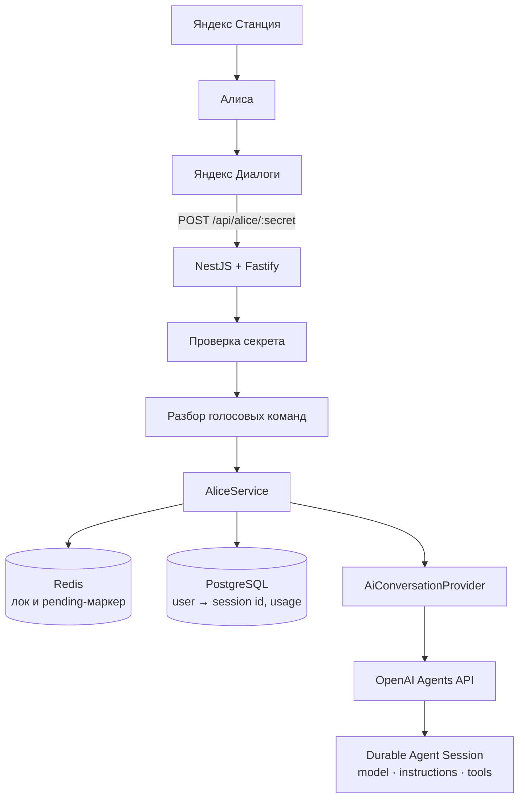

# makealicebetter

Бэкенд приватного навыка Яндекс Алисы, который отвечает на любые вопросы через **OpenAI Agents API**.

Вы говорите колонке «Алиса, запусти <навык>», дальше — обычный разговор: «что приготовить из курицы и капусты», «объясни простыми словами квантовую запутанность». Навык помнит контекст беседы, умеет продолжать длинные ответы и переживает перезапуск сервера.

```
Яндекс Станция → Алиса → Яндекс Диалоги → этот бэкенд → OpenAI Agent Session
```

## Содержание

- [Как это устроено](#как-это-устроено)
- [Требования](#требования)
- [Настройка OpenAI](#настройка-openai)
- [Переменные окружения](#переменные-окружения)
- [Локальная разработка](#локальная-разработка)
- [Docker Compose](#docker-compose)
- [Миграции базы данных](#миграции-базы-данных)
- [Настройка навыка в Яндекс Диалогах](#настройка-навыка-в-яндекс-диалогах)
- [Ручная проверка webhook](#ручная-проверка-webhook)
- [Отложенные ответы](#отложенные-ответы)
- [Голосовые команды](#голосовые-команды)
- [Профили моделей](#профили-моделей)
- [Статистика использования](#статистика-использования)
- [Тесты](#тесты)
- [Деплой в продакшн](#деплой-в-продакшн)
- [Безопасность](#безопасность)
- [Диагностика проблем](#диагностика-проблем)
- [Известные ограничения](#известные-ограничения)

## Как это устроено

Ключевая идея: **историю разговора хранит OpenAI**, а не этот бэкенд. Один разговор с Алисой — одна durable Agent Session. Мы не собираем и не пересылаем последние N сообщений: сессия сама помнит контекст, а Postgres хранит только связку «пользователь Алисы → id сессии».



Вторая идея: **мы можем перестать ждать, но не отменяем turn**. У Яндекс Диалогов жёсткий лимит ответа — 4,5 секунды. Если модель не успела, мы закрываем поток событий (turn продолжает выполняться на стороне OpenAI), запоминаем его в Redis и отвечаем «нужно ещё немного времени». Следующей фразой «ну что» пользователь забирает готовый ответ.

### Структура кода

| Модуль | Ответственность |
|---|---|
| `src/alice` | Протокол Диалогов: контроллер, guard секрета, DTO, разбор команд, сборка ответа, оркестрация запроса |
| `src/ai` | Единственная граница с beta Agents API: интерфейс `AiConversationProvider`, боевой `OpenAIAgentsService`, `FakeAgentsProvider` для локальной проверки |
| `src/conversations` | Postgres: пользователи, разговоры, записи о turn'ах (entity + сервис) |
| `src/pending` | Redis: лок «один turn на пользователя» и маркер незавершённого ответа |
| `src/speech` | Приведение ответа модели к голосу: markdown, списки, ссылки, длина |
| `src/usage` | Учёт токенов и агрегаты для админки |
| `src/tools` | Реестр локальных функций, которые может вызвать агент (пока пуст) |
| `src/memory` | Абстракция долговременной памяти между разговорами (пока `NoopMemoryService`) |
| `src/admin`, `src/health` | `/api/admin/usage`, `/health`, `/ready` |

## Требования

- Node.js 24 LTS (минимум 22.13)
- PostgreSQL 16+ (проверено на 18)
- Redis 7+ (проверено на 8)
- Аккаунт OpenAI с доступом к Agents API (beta)

Либо просто Docker — compose поднимает всё сразу.

## Настройка OpenAI

Модель, инструкции, reasoning и инструменты живут **в сохранённом агенте**, а не в коде. Бэкенд знает только его id.

1. Откройте [OpenAI Platform](https://platform.openai.com/) и создайте агента (Agents → Create).
2. Впишите инструкции — рекомендуемый вариант:

   ```text
   Ты домашний голосовой AI-ассистент.

   Ответ будет озвучен голосовой колонкой.

   Поэтому:
   - отвечай естественно и по-человечески;
   - по умолчанию кратко, без вступлений;
   - избегай markdown и таблиц;
   - не произноси длинные URL;
   - большие списки сокращай до главного;
   - не выводи куски кода, если об этом не попросили явно;
   - отвечай на русском языке, если пользователь не попросил иначе.
   ```

3. Рекомендуемые настройки агента:

   | Параметр | Значение | Почему |
   |---|---|---|
   | Environment | `none` | Ассистенту не нужен sandbox, а без него ответы быстрее |
   | Text format | `text` | В голос идёт обычный текст, не JSON |
   | Verbosity | `low` или `medium` | Длинные ответы не влезают в лимит Алисы (1024 символа) |
   | Reasoning effort | `low` или `medium` | Высокий заметно увеличивает долю отложенных ответов |
   | Tools | по желанию | Web search и MCP работают на стороне OpenAI, бэкенд про них знать не должен |

4. Скопируйте id агента (`agent_...`) в `OPENAI_AGENT_ID`.
5. Создайте API-ключ проекта. Для Agents API нужны права:

   ```text
   api.agents.read
   api.agents.write
   api.responses.write
   ```

   Заголовок `OpenAI-Beta: agents=v1` SDK добавляет сам.

## Переменные окружения

Полный список — в [`.env.example`](.env.example).

Обязательные:

| Переменная | Описание |
|---|---|
| `OPENAI_API_KEY` | Ключ проекта OpenAI с правами выше |
| `OPENAI_AGENT_ID` | Id сохранённого агента |
| `ALICE_WEBHOOK_SECRET` | Секрет в пути webhook: `POST /api/alice/<секрет>` |
| `POSTGRES_HOST` / `PORT` / `USER` / `PASSWORD` / `DB` | Подключение к Postgres |
| `REDIS_HOST` / `REDIS_PORT` | Подключение к Redis |

Необязательные (с разумными значениями по умолчанию):

| Переменная | По умолчанию | Описание |
|---|---|---|
| `ALICE_LLM_SOFT_TIMEOUT_MS` | `3200` | Сколько ждём ответ, прежде чем уйти в отложенный режим. Лимит Диалогов — 4500 мс, запас нужен на сеть |
| `MAX_VOICE_RESPONSE_CHARS` | `900` | Максимум символов в ответе. Выше 1024 поднять нельзя: это лимит Яндекса |
| `PENDING_STATE_TTL_SECONDS` | `600` | Сколько живёт маркер незавершённого ответа |
| `OPENAI_MODEL_FAST` / `OPENAI_MODEL_SMART` | — | Модели для команд «быстрая / умная модель». Если пусто, переключение отключено |
| `OPENAI_REQUEST_TIMEOUT_MS` | `30000` | Таймаут одного HTTP-вызова к OpenAI |
| `ADMIN_API_KEY` | — | Ключ для `/api/admin/usage`. Если пусто, эндпоинт закрыт |
| `ALICE_SKILL_ID` | — | Если задан, чужие `skill_id` отбрасываются |
| `OPENAI_FAKE` | `false` | Локальная проверка без ключа: вместо OpenAI работает фейковый провайдер в памяти |
| `PORT` | `3000` | Порт HTTP |

Приложение проверяет переменные при старте и падает с понятным сообщением, если чего-то не хватает.

## Локальная разработка

```bash
cp .env.example .env         # заполнить OPENAI_API_KEY, OPENAI_AGENT_ID, ALICE_WEBHOOK_SECRET
npm install
npm run migration:run
npm run dev
```

Если ключа OpenAI пока нет, поставьте `OPENAI_FAKE=true` — поднимется фейковый провайдер, который ведёт себя как настоящий: помнит сессию, умеет отвечать медленно (`FAKE_DELAY_MS`), падать (`FAKE_FAIL=true`), отменять turn (`FAKE_CANCEL=true`) и запрашивать вызов функции (`FAKE_REQUIRES_ACTION=true`).

Полезные команды:

```bash
npm run typecheck   # tsc --noEmit
npm run lint        # eslint
npm run format      # prettier
npm test            # unit-тесты
npm run test:e2e    # e2e: нужны Postgres (база alice_test) и Redis
npm run build
```

## Docker Compose

```bash
cp .env.example .env
docker compose up -d --build
docker compose exec app npm run migration:run:built
curl localhost:3000/health
```

Хосты баз внутри compose подставляются автоматически (`postgres`, `redis`), поэтому один и тот же `.env` годится и для локального запуска, и для контейнеров. А вот `POSTGRES_DB` общий для обоих режимов: если поменяете имя базы уже после первого запуска, пересоздайте том (`docker compose down -v`) или заведите базу вручную.

`migration:run:built` запускает миграции по уже собранному коду — в образе нет `devDependencies`, поэтому пересборка там невозможна.

После изменения `.env` контейнер нужно пересоздать (`docker compose up -d --force-recreate app`): `docker compose restart` переменные не перечитывает.

Поднимаются три сервиса: `app`, `postgres` (с volume `pgdata`), `redis` (с volume `redisdata`). У всех настроены healthcheck'и, приложение стартует только после готовности зависимостей. Секреты берутся из `.env`, в сам compose-файл ничего не вписано.

## Миграции базы данных

`synchronize` всегда выключен — схема меняется только миграциями.

```bash
npm run migration:generate -- src/database/migrations/ИмяМиграции
npm run migration:run          # локально: собирает проект и применяет миграции
npm run migration:run:built    # в контейнере: применяет по готовому dist
npm run migration:revert
npm run migration:show
```

Схема:

```text
users          id, alice_user_id (unique), id_source, created_at, updated_at
conversations  id, user_id → users, openai_session_id (unique), status, created_at, updated_at
               уникальный частичный индекс: один активный разговор на пользователя
turn_records   id, conversation_id → conversations, openai_turn_id (unique), status,
               model, input_tokens, output_tokens, reasoning_tokens, cached_tokens,
               latency_ms, deferred, created_at, completed_at
```

Тексты сообщений **не хранятся**: сам разговор живёт в Agent Session, дублировать его в Postgres незачем.

## Настройка навыка в Яндекс Диалогах

1. Откройте [Яндекс Диалоги](https://dialogs.yandex.ru/developer) → «Создать диалог» → «Навык в Алисе».
2. Заполните название и активационную фразу — по ней навык запускается («Алиса, запусти …»).
3. В поле **Backend** выберите «Своя платформа» и укажите адрес webhook:

   ```text
   https://ваш-домен/api/alice/<ALICE_WEBHOOK_SECRET>
   ```

   Нужен именно HTTPS с валидным сертификатом — Диалоги не ходят по HTTP.
4. В настройках публикации выберите **приватный навык** (доступен только вашему аккаунту) и добавьте себя в список тестировщиков.
5. Сохраните и проверьте навык во вкладке «Тестирование».

### Как защищён webhook

Яндекс не подписывает запросы, поэтому защита — секрет в пути. Сравнение идёт побайтово за постоянное время (`timingSafeEqual`), неверный секрет получает `403` без тела Алисы. Дополнительно можно задать `ALICE_SKILL_ID`: тогда запросы с чужим `skill_id` отбрасываются. Секрет длиной 32+ случайных символа — разумный минимум:

```bash
openssl rand -hex 24
```

## Ручная проверка webhook

```bash
curl -X POST "http://localhost:3000/api/alice/$ALICE_WEBHOOK_SECRET" \
  -H 'Content-Type: application/json' \
  -d '{
    "meta": {"locale": "ru-RU", "timezone": "Europe/Moscow", "interfaces": {}},
    "session": {
      "session_id": "test-session",
      "message_id": 1,
      "skill_id": "test-skill",
      "application": {"application_id": "test-device"},
      "new": false
    },
    "request": {"type": "SimpleUtterance", "command": "что приготовить из курицы"},
    "version": "1.0"
  }'
```

Ответ:

```json
{
  "response": { "text": "…", "tts": "…", "end_session": false },
  "version": "1.0"
}
```

## Отложенные ответы

```text
Вопрос → turn запущен → ждём до ALICE_LLM_SOFT_TIMEOUT_MS
   ├─ успели  → отвечаем сразу
   └─ не успели → закрываем поток (turn продолжается!), пишем маркер в Redis,
                  отвечаем «мне нужно ещё немного времени»
                      ↓
        «ну что» → читаем статус turn'а
                   ├─ completed → достаём ответ из items сессии
                   ├─ ещё идёт  → «я ещё думаю»
                   └─ failed    → понятное сообщение об ошибке
```

Важные детали:

- Turn никогда не отменяется: мы закрываем только своё соединение.
- Готовый ответ не дублируется в Redis — он берётся из сохранённых items сессии. Redis хранит лишь `{conversationId, openaiSessionId, turnId, startedAt}` с TTL.
- Пока turn активен, новый вопрос **не** отправляется в сессию: Agents API воспринял бы его как «подруливание» текущим ответом. Пользователь услышит «я ещё думаю над предыдущим вопросом».
- Если Redis потерял состояние, бэкенд спрашивает статус сессии напрямую у OpenAI.

## Голосовые команды

| Что сказать | Что произойдёт |
|---|---|
| `новый разговор`, `начни новый разговор`, `забудь текущий разговор` | Текущий разговор архивируется, следующий вопрос начинает новую Agent Session. Старая сессия в OpenAI не удаляется |
| `быстрая модель`, `используй быструю модель` | Переключение на `OPENAI_MODEL_FAST` со следующего вопроса |
| `умная модель`, `используй умную модель` | Переключение на `OPENAI_MODEL_SMART` |
| `какая модель` | «Сейчас используется быстрая/умная модель» |
| `ну что`, `готово`, `что там`, `есть ответ`, `что получилось` | Забрать отложенный ответ |
| `помощь`, `что ты умеешь` | Короткая справка |

Команда срабатывает только если фраза сказана целиком (допускается одна опечатка распознавания). «Расскажи, что там происходило в Сталкере» — это обычный вопрос, а не запрос отложенного ответа.

## Профили моделей

Модель по умолчанию задаётся в сохранённом агенте. Если заполнены `OPENAI_MODEL_FAST` и `OPENAI_MODEL_SMART`, голосовые команды меняют модель текущей сессии через `sessions.update` — **история при этом сохраняется**, но новая модель применяется со следующего вопроса. Если переменные пустые, навык честно отвечает «переключение моделей не настроено».

## Статистика использования

```bash
curl -H "Authorization: Bearer $ADMIN_API_KEY" localhost:3000/api/admin/usage
```

```json
{
  "today":  { "requests": 12, "inputTokens": 5400, "outputTokens": 2300 },
  "month":  { "requests": 340, "inputTokens": 152000, "outputTokens": 64000 },
  "models": [{ "model": "gpt-6-luna", "requests": 300, "inputTokens": 140000, "outputTokens": 60000 }],
  "activeUsers": 2,
  "users": 3,
  "conversations": 15,
  "pendingTurns": 0
}
```

Данные берутся из локальной таблицы `turn_records`, billing API OpenAI не дёргается.

Health-эндпоинты: `GET /health` (жив ли процесс) и `GET /ready` (доступны ли Postgres и Redis). OpenAI в проверках не участвует.

## Тесты

```bash
npm test         # unit — OpenAI замокан, сеть не нужна
npm run test:e2e # e2e — нужны Postgres (база alice_test) и Redis
```

Покрыты: разбор голосовых команд, очистка речи и лимит длины, создание и переиспользование сессии, восстановление разговора после рестарта, отложенные ответы и их выдача, блокировка параллельных turn'ов, падение/отмена turn'а, обработка required actions, недоступность Postgres, guard'ы webhook и админки, health-эндпоинты.

Живой интеграционный тест с реальным агентом включается отдельно и в CI не гоняется, чтобы не тратить деньги.

## Деплой в продакшн

В `deploy/` лежит всё необходимое: compose-файл с Caddy, конфиг прокси и скрипт выкладки.

```bash
# на сервере: A-запись домена уже указывает сюда, порты 80 и 443 свободны
SSH_HOST=alice.pavser.space SSH_USER=root ./deploy/deploy.sh
```

Скрипт копирует исходники (`.env` на сервере не трогает), собирает образ, поднимает стек и применяет миграции.

Отличия от dev-стека:

- приложение **не публикует порт наружу** — единственная точка входа это Caddy;
- Caddy сам выпускает и продлевает сертификат Let's Encrypt, покупать SSL у регистратора не нужно;
- `POSTGRES_PASSWORD` обязателен: compose откажется стартовать со значением по умолчанию;
- URI запросов вырезаны из логов Caddy, потому что секрет навыка находится прямо в пути.

Дальше: пропишите webhook `https://alice.pavser.space/api/alice/<секрет>` в настройках навыка и настройте мониторинг на `/ready`. Полезный алерт — рост доли отложенных ответов: значит, у агента завышен reasoning effort.

Приложение корректно обрабатывает `SIGTERM`/`SIGINT`: закрывает HTTP-сервер, пул Postgres и соединение Redis (в Docker остановка занимает около секунды, а не 10 секунд до `SIGKILL`).

### Поведение при частичных отказах

| Что упало | Что происходит |
|---|---|
| Redis | Разговор работает: session id лежит в Postgres. Недоступны лок и отложенные ответы |
| PostgreSQL | Навык вежливо просит попробовать позже. Новые сессии **не** создаются — иначе при каждом запросе плодились бы «осиротевшие» сессии |
| OpenAI | «Сейчас не получилось получить ответ. Попробуй ещё раз.» — всегда валидный ответ Алисе, никогда не 500 |

## Безопасность

- Секреты только в `.env`; файл в `.gitignore` и не попадает в образ (`.dockerignore`).
- Webhook защищён секретом в пути, сравнение за постоянное время; админка — bearer-токеном.
- В логи не попадают ключи, заголовок `Authorization`, пароль БД и тексты разговоров. Идентификатор пользователя Алисы логируется хешем.
- Ошибки провайдера не доходят до пользователя дословно — он слышит нейтральную фразу, детали остаются в логах.
- Все запросы к БД идут через TypeORM с параметрами; динамического SQL из пользовательского текста нет.
- `synchronize: false` — схему меняют только миграции.

## Диагностика проблем

| Симптом | Причина и что делать |
|---|---|
| Алиса говорит «навык не отвечает» | Ответ не уложился в 4,5 с. Проверьте сеть до OpenAI и понизьте `ALICE_LLM_SOFT_TIMEOUT_MS`, а у агента — reasoning effort |
| В логах `OPENAI_AGENT_ID … was not found` | Агент удалён или id от другого проекта. Проверка выполняется при старте |
| `the API key lacks Agents API permissions` | У ключа нет `api.agents.read` / `api.agents.write` / `api.responses.write` |
| Постоянно «Я ещё думаю над предыдущим вопросом» | В Redis остался маркер, а turn уже завершился. Маркер живёт `PENDING_STATE_TTL_SECONDS`; можно удалить вручную: `redis-cli del "alice:user:<hash>:pending"` |
| `403` на webhook | Секрет в URL не совпадает с `ALICE_WEBHOOK_SECRET` |
| `/ready` отвечает `degraded` | Недоступен Postgres или Redis — конкретный сервис указан в теле ответа |
| Ответ обрывается на полуслове | Ответ длиннее `MAX_VOICE_RESPONSE_CHARS`; навык обрезает по границе предложения и предлагает продолжить |

## Известные ограничения

- Долговременная память между разговорами не реализована: `MemoryService` — это заготовка (`NoopMemoryService`), точка подключения уже есть.
- Локальных инструментов нет: `ToolRegistryService` пуст. Инструменты самого агента (web search, MCP, коннекторы) выполняются на стороне OpenAI и работают без изменений в коде.
- Старые Agent Session не удаляются автоматически — это отдельная задача обслуживания.
- Если Redis потерял маркер, а turn успел завершиться, отложенный ответ забрать уже нельзя: навык ответит «у меня нет готового ответа».
- Смена модели применяется со следующего вопроса — так устроен Agents API.
- Карточки, кнопки и другие визуальные возможности Алисы не используются: навык рассчитан на колонку.

## Лицензия

[MIT](LICENSE)
