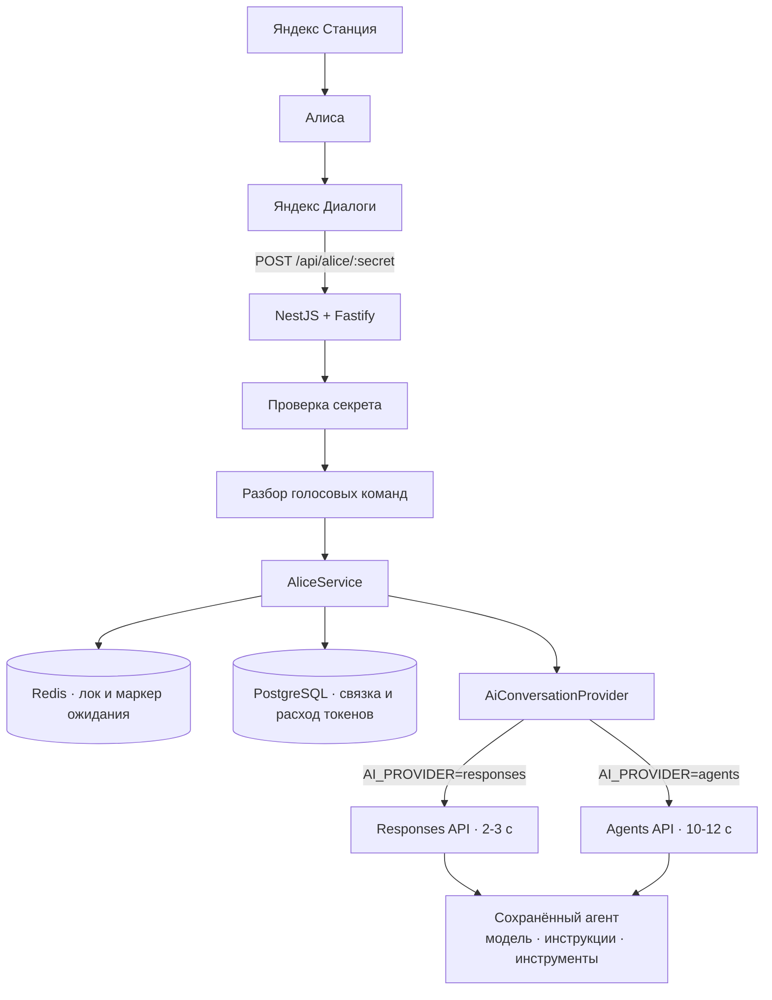

# makealicebetter

*[English](README.en.md) · Русский*

Бэкенд приватного навыка Яндекс Алисы, который отвечает на любые вопросы через OpenAI.

Вы говорите колонке «Алиса, спроси у дяди робота, что приготовить из курицы и капусты» — и ответ приходит сразу, вместе с запуском навыка. Или запускаете навык отдельно и дальше говорите как обычно: «объясни простыми словами квантовую запутанность», «а подробнее?». («Дядя робот» здесь — активационная фраза, вы задаёте свою.) Навык помнит контекст беседы, укладывается в жёсткий лимит Диалогов и переживает перезапуск сервера.

```
Яндекс Станция → Алиса → Яндекс Диалоги → этот бэкенд → OpenAI
```

## Содержание

- [Как это устроено](#как-это-устроено) · [Структура кода](#структура-кода)
- [Быстрый старт](#быстрый-старт)
- [Настройка OpenAI](#настройка-openai)
- [Настройка навыка в Яндекс Диалогах](#настройка-навыка-в-яндекс-диалогах)
- [Скорость ответа](#скорость-ответа)
- [Отложенные ответы](#отложенные-ответы)
- [Голосовые команды](#голосовые-команды)
- [Переменные окружения](#переменные-окружения)
- [База данных](#база-данных)
- [Эксплуатация](#эксплуатация) · [При частичных отказах](#при-частичных-отказах)
- [Деплой](#деплой)
- [Безопасность](#безопасность)
- [Диагностика](#диагностика)
- [Тесты](#тесты)
- [Известные ограничения](#известные-ограничения)
- [Лицензия](#лицензия)

## Как это устроено

**Историю разговора хранит OpenAI, а не этот бэкенд.** Один разговор с Алисой — один разговор на стороне OpenAI. Мы не собираем и не пересылаем последние N сообщений: контекст помнит OpenAI, а Postgres хранит только связку «пользователь Алисы → id разговора».



**Если ответ не успевает — он не пропадает.** У Диалогов жёсткий лимит 4,5 секунды. Не уложились — отвечаем «нужно ещё немного времени», но соединение не рвём: ответ дописывается в фоне, и следующей фразой «ну что» пользователь его забирает.

### Структура кода

| Модуль | Ответственность |
|---|---|
| `src/alice` | Протокол Диалогов: контроллер, guard секрета, DTO, разбор команд, сборка ответа, оркестрация |
| `src/ai` | Единственная граница с OpenAI: интерфейс `AiConversationProvider`, быстрый `OpenAIResponsesService`, медленный `OpenAIAgentsService`, фейковый провайдер для локальной проверки |
| `src/conversations` | Postgres: пользователи, разговоры, записи о turn'ах |
| `src/pending` | Redis: лок «один ответ на пользователя» и маркер незавершённого ответа |
| `src/speech` | Приведение ответа к голосу: markdown, списки, ссылки, длина |
| `src/usage` | Учёт токенов и агрегаты для админки |
| `src/tools` | Реестр локальных функций, которые может вызвать агент (пока пуст) |
| `src/memory` | Заготовка долговременной памяти между разговорами |
| `src/admin`, `src/health` | `/api/admin/usage`, `/health`, `/ready` |

## Быстрый старт

Нужны Node.js 24 LTS (минимум 22.13), PostgreSQL 16+, Redis 7+ и аккаунт OpenAI. Либо просто Docker — compose поднимает всё сразу.

```bash
cp .env.example .env    # заполнить OPENAI_API_KEY, OPENAI_AGENT_ID, ALICE_WEBHOOK_SECRET
docker compose up -d --build
docker compose exec app npm run migration:run:built
curl localhost:3000/health
```

Локально, без контейнеров:

```bash
npm install
npm run migration:run
npm run dev
```

Ключа OpenAI пока нет? Поставьте `OPENAI_FAKE=true` — поднимется фейковый провайдер, который ведёт себя как настоящий: помнит разговор, умеет отвечать медленно (`FAKE_DELAY_MS`), падать (`FAKE_FAIL=true`), отменять ответ (`FAKE_CANCEL=true`) и запрашивать вызов функции (`FAKE_REQUIRES_ACTION=true`).

## Настройка OpenAI

Модель, инструкции, reasoning и инструменты живут **в сохранённом агенте**, а не в коде: бэкенд знает только его id и передаёт эти настройки в каждый запрос.

1. Откройте [OpenAI Platform](https://platform.openai.com/) → Agents → Create.
2. Впишите инструкции. Рабочий вариант для голоса:

   ```text
   Ты домашний голосовой AI-ассистент. Ответ будет озвучен колонкой.

   Отвечай естественно и кратко, без вступлений.
   Не используй markdown, таблицы и заголовки.
   Никогда не приводи ссылки и адреса сайтов — их невозможно произнести;
   если нужно назвать источник, назови его словами.
   Большие списки сокращай до главного.
   Отвечай по-русски, если пользователь не попросил иначе.

   Веб-поиском пользуйся только когда ответ зависит от свежих данных:
   новости, погода, курсы, расписания. Факты, объяснения, советы
   и подборки отвечай сам — поиск добавляет около трёх секунд.
   ```

3. Настройки агента:

   | Параметр | Значение | Почему |
   |---|---|---|
   | Environment | `none` | Ассистенту не нужен sandbox, без него быстрее |
   | Text format | `text` | В голос идёт обычный текст |
   | Verbosity | `low` | Длинный ответ не влезает в лимит Алисы (1024 символа) |
   | Reasoning effort | `low` | Выше — заметно медленнее: 2,0 с против 4,3 с на том же вопросе |
   | Tools | по желанию | Web search и MCP выполняются на стороне OpenAI |

4. Скопируйте id агента (`agent_…`) в `OPENAI_AGENT_ID`.
5. Создайте API-ключ проекта. Нужны права `api.responses.write`, а для `AI_PROVIDER=agents` ещё `api.agents.read` и `api.agents.write`.

## Настройка навыка в Яндекс Диалогах

1. [Яндекс Диалоги](https://dialogs.yandex.ru/developer) → «Создать диалог» → «Навык в Алисе».
2. Заполните название и активационную фразу. Её произносят не только при запуске: «Алиса, спроси у дяди робота <вопрос>»
   передаёт вопрос первым же запросом, и навык отвечает на него сразу, без отдельного приветствия.
   Выбирайте фразу, которую Алиса уверенно распознаёт на слух.
3. **Backend** → «Своя платформа», адрес webhook:

   ```text
   https://ваш-домен/api/alice/<ALICE_WEBHOOK_SECRET>
   ```

   Нужен HTTPS с валидным сертификатом: по HTTP Диалоги не ходят.
4. В публикации выберите **приватный навык** и добавьте себя в тестировщики.
5. Проверьте во вкладке «Тестирование».

**Как защищён webhook.** Яндекс не подписывает запросы, поэтому защита — секрет в пути. Сравнение побайтовое за постоянное время, неверный секрет получает `403`. Дополнительно можно задать `ALICE_SKILL_ID` — тогда чужие `skill_id` отбрасываются. Секрет: `openssl rand -hex 24`.

Проверить webhook вручную:

```bash
curl -X POST "http://localhost:3000/api/alice/$ALICE_WEBHOOK_SECRET" \
  -H 'Content-Type: application/json' \
  -d '{
    "meta": {"locale": "ru-RU", "timezone": "Europe/Moscow", "interfaces": {}},
    "session": {
      "session_id": "test", "message_id": 1, "skill_id": "test",
      "application": {"application_id": "test-device"}, "new": false
    },
    "request": {"type": "SimpleUtterance", "command": "что приготовить из курицы"},
    "version": "1.0"
  }'
```

## Скорость ответа

Диалоги ждут 4,5 секунды, и в лимит входит всё: сеть Яндекса, наша обработка и поход в OpenAI. Замеры с боевого сервера (`gpt-6-luna`, reasoning `low`):

| Что меряли | Время |
|---|---|
| Round-trip до OpenAI | ~0,9 с |
| **Responses API — готовый ответ** | **1,9–3,2 с** |
| Agents API — только запуск turn'а | 7,2–8,5 с |
| Agents API — готовый ответ | 9,5–12,2 с |

Разница не в модели: Agents API тратит около восьми секунд на то, чтобы **начать** работу, и это не зависит ни от reasoning effort, ни от инструментов, ни от `service_tier` (проверены `default`, `priority`, `fast`). Платформа рассчитана на долгие агентные задачи, а не на реплику в диалоге.

Поэтому по умолчанию работает Responses API (`AI_PROVIDER=responses`) — те же настройки агента, но ответ в разы быстрее. `AI_PROVIDER=agents` возвращает durable Agent Session: он нужен, когда важнее не скорость, а долгая работа с инструментами и субагентами.

Что сделано, чтобы укладываться в лимит:

- дедлайн отсчитывается от прихода запроса и покрывает все вызовы к OpenAI, включая открытие соединения;
- ретраи SDK на горячем пути отключены — повтор после таймаута удваивал ожидание;
- `reasoning` и `verbosity` передаются из агента: без них работает умолчание модели, и это вдвое медленнее;
- соединение **не прерывается** по истечении бюджета, иначе OpenAI отбрасывает весь обмен — теряется и вопрос, и ответ.

## Отложенные ответы

```text
вопрос → ждём до ALICE_LLM_SOFT_TIMEOUT_MS
   ├─ успели     → отвечаем сразу
   └─ не успели  → маркер в Redis + «нужно ещё немного времени»
                   (соединение живо, ответ дописывается в фоне)
                        ↓
        «ну что» → читаем статус ответа по его id
                   ├─ готов     → произносим
                   ├─ пишется   → «я ещё думаю»
                   └─ ошибка    → понятная фраза
```

Детали, которые важны на практике:

- ответ читается **по id**, а не «последним сообщением разговора»: элементы разговора не содержат отметок времени, и без id невозможно отличить новый ответ от предыдущего;
- если задержка из-за веб-поиска, навык так и говорит — «посмотрю в интернете» (это видно по событиям `response.web_search_call.*`);
- пока ответ готовится, новый вопрос не отправляется: пользователь услышит «я ещё думаю над предыдущим вопросом»;
- Redis хранит только маркер `{conversationId, openaiSessionId, turnId, startedAt}` с TTL — сам ответ живёт у OpenAI.

## Голосовые команды

| Что сказать | Что произойдёт |
|---|---|
| `новый разговор`, `забудь текущий разговор` | Текущий разговор архивируется, следующий вопрос начинает новый. Старый в OpenAI не удаляется |
| `ну что`, `готово`, `что там`, `есть ответ`, `что получилось` | Забрать отложенный ответ |
| `быстрая модель` / `умная модель` | Переключение между `OPENAI_MODEL_FAST` и `OPENAI_MODEL_SMART` (только при `AI_PROVIDER=agents`) |
| `какая модель` | «Сейчас используется быстрая/умная модель» |
| `помощь`, `что ты умеешь` | Короткая справка |

Команда срабатывает только если фраза сказана целиком (допускается одна опечатка распознавания). «Расскажи, что там происходило в Сталкере» — обычный вопрос, а не запрос отложенного ответа.

## Переменные окружения

Полный список — в [`.env.example`](.env.example). Приложение проверяет их при старте и падает с понятным сообщением, если чего-то не хватает.

Обязательные:

| Переменная | Описание |
|---|---|
| `OPENAI_API_KEY` | Ключ проекта OpenAI |
| `OPENAI_AGENT_ID` | Id сохранённого агента |
| `ALICE_WEBHOOK_SECRET` | Секрет в пути webhook: `POST /api/alice/<секрет>` |
| `POSTGRES_HOST` / `PORT` / `USER` / `PASSWORD` / `DB` | Подключение к Postgres |
| `REDIS_HOST` / `REDIS_PORT` | Подключение к Redis |

Необязательные:

| Переменная | По умолчанию | Описание |
|---|---|---|
| `AI_PROVIDER` | `responses` | `responses` — быстрый путь, `agents` — durable Agent Session |
| `ALICE_LLM_SOFT_TIMEOUT_MS` | `3700` | Сколько ждём ответ. Лимит Диалогов 4500 мс, запас нужен на сеть |
| `MAX_VOICE_RESPONSE_CHARS` | `900` | Максимум символов. Выше 1024 нельзя — лимит Яндекса |
| `PENDING_STATE_TTL_SECONDS` | `600` | Сколько живёт маркер незавершённого ответа |
| `OPENAI_MODEL_FAST` / `OPENAI_MODEL_SMART` | — | Модели для голосового переключения. Пусто — переключение отключено |
| `OPENAI_REQUEST_TIMEOUT_MS` | `30000` | Таймаут HTTP-вызова к OpenAI |
| `ADMIN_API_KEY` | — | Ключ для `/api/admin/usage`. Пусто — эндпоинт закрыт |
| `ALICE_SKILL_ID` | — | Если задан, чужие `skill_id` отбрасываются |
| `OPENAI_FAKE` | `false` | Фейковый провайдер вместо OpenAI |
| `PORT` | `3000` | Порт HTTP |

## База данных

`synchronize` всегда выключен — схема меняется только миграциями.

```bash
npm run migration:generate -- src/database/migrations/ИмяМиграции
npm run migration:run          # локально: собирает проект и применяет
npm run migration:run:built    # в контейнере: применяет по готовому dist
npm run migration:revert
npm run migration:show
```

```text
users          id, alice_user_id (unique), id_source, created_at, updated_at
conversations  id, user_id → users, openai_session_id (unique), status, created_at, updated_at
               частичный уникальный индекс: один активный разговор на пользователя
turn_records   id, conversation_id → conversations, openai_turn_id (unique), status,
               model, input_tokens, output_tokens, reasoning_tokens, cached_tokens,
               latency_ms, deferred, created_at, completed_at
```

Тексты сообщений **не хранятся**: разговор живёт на стороне OpenAI, дублировать его незачем.

## Эксплуатация

Статистика расхода — из локальной таблицы `turn_records`, billing API OpenAI не дёргается:

```bash
curl -H "Authorization: Bearer $ADMIN_API_KEY" localhost:3000/api/admin/usage
```

```json
{
  "today":  { "requests": 12, "inputTokens": 5400, "outputTokens": 2300 },
  "month":  { "requests": 340, "inputTokens": 152000, "outputTokens": 64000 },
  "models": [{ "model": "gpt-6-luna", "requests": 300, "inputTokens": 140000, "outputTokens": 60000 }],
  "activeUsers": 2, "users": 3, "conversations": 15, "pendingTurns": 0
}
```

`GET /health` — жив ли процесс, `GET /ready` — доступны ли Postgres и Redis. OpenAI в проверках не участвует: health-проба не должна стоить денег.

Приложение корректно обрабатывает `SIGTERM`/`SIGINT` — в Docker остановка занимает около секунды, а не 10 секунд до `SIGKILL`.

### При частичных отказах

| Что упало | Что происходит |
|---|---|
| Redis | Разговор работает: id лежит в Postgres. Недоступны лок и отложенные ответы |
| PostgreSQL | Навык просит попробовать позже. Новые разговоры **не** создаются — иначе плодились бы «осиротевшие» |
| OpenAI | «Сейчас не получилось получить ответ. Попробуй ещё раз» — всегда валидный ответ Алисе, никогда не 500 |

## Деплой

В `deploy/` лежит всё необходимое: compose-файл с Caddy, конфиг прокси и скрипт выкладки.

```bash
SSH_HOST=ваш-домен SSH_USER=root SSH_KEY=~/.ssh/id_ed25519 ./deploy/deploy.sh
```

Скрипт копирует исходники (`.env` на сервере не трогает), собирает образ, поднимает стек и применяет миграции.

Отличия от dev-стека:

- приложение **не публикует порт наружу** — единственная точка входа это Caddy;
- Caddy сам выпускает и продлевает сертификат Let's Encrypt, покупать SSL не нужно;
- `POSTGRES_PASSWORD` обязателен: compose откажется стартовать со значением по умолчанию;
- URI запросов вырезаны из логов Caddy, потому что секрет навыка находится прямо в пути.

Запускаете compose вручную — не забудьте `--project-directory .`, иначе каталогом проекта станет `deploy/` и `.env` из корня не найдётся. После изменения `.env` контейнер нужно пересоздать (`up -d --force-recreate app`): `restart` переменные не перечитывает.

## Безопасность

- Секреты только в `.env`; файл в `.gitignore` и не попадает в образ.
- Webhook защищён секретом в пути со сравнением за постоянное время, админка — bearer-токеном.
- В логи не попадают ключи, заголовок `Authorization`, пароль БД и тексты разговоров. Идентификатор пользователя логируется хешем.
- Ошибки провайдера не доходят до пользователя дословно — он слышит нейтральную фразу, детали остаются в логах.
- Запросы к БД идут через TypeORM с параметрами; динамического SQL из пользовательского текста нет.

## Диагностика

| Симптом | Причина и что делать |
|---|---|
| Алиса говорит «навык не отвечает» | Ответ не уложился в 4,5 с. Понизьте `ALICE_LLM_SOFT_TIMEOUT_MS` и reasoning effort у агента |
| `OPENAI_AGENT_ID … was not found` | Агент удалён или id от другого проекта. Проверка выполняется при старте |
| `the API key lacks … permissions` | У ключа нет нужных прав (см. «Настройка OpenAI») |
| «Я ещё думаю» не проходит | Посмотрите логи: там видно, читается ли ответ и какой у него статус |
| `403` на webhook | Секрет в URL не совпадает с `ALICE_WEBHOOK_SECRET` |
| `/ready` отвечает `degraded` | Недоступен Postgres или Redis — конкретный сервис указан в теле ответа |
| Ответ обрывается на полуслове | Длиннее `MAX_VOICE_RESPONSE_CHARS`; навык режет по границе предложения и предлагает продолжить |

## Тесты

```bash
npm test         # unit — OpenAI замокан, сеть не нужна
npm run test:e2e # e2e — нужны Postgres (база alice_test) и Redis
```

Покрыты: разбор команд, очистка речи и лимит длины, создание и переиспользование разговора, восстановление после рестарта, отложенные ответы и их выдача, блокировка параллельных ответов, ошибки и отмена, недоступность Postgres, guard'ы webhook и админки, health-эндпоинты.

## Известные ограничения

- **Длинные ответы приходят вторым шагом** — если модель не уложилась в бюджет, навык просит переспросить «ну что». На `AI_PROVIDER=agents` так работает почти каждый вопрос.
- Переключение моделей голосом работает только на пути `agents`; на быстром пути модель задаётся в сохранённом агенте.
- Долговременная память между разговорами не реализована: `MemoryService` — заготовка, точка подключения уже есть.
- Локальных инструментов нет: `ToolRegistryService` пуст. Инструменты самого агента работают без изменений в коде.
- Старые разговоры в OpenAI не удаляются автоматически — это отдельная задача обслуживания.
- Если пользователь заговорил, не дождавшись отложенного ответа, навык отвечает на последнюю реплику: предыдущий ответ остаётся в истории разговора, но вслух не звучит.
- Карточки, кнопки и другие визуальные возможности Алисы не используются: навык рассчитан на колонку.

## Лицензия

[MIT](LICENSE)
